# 📘 Manuale Utente: VDS-VL Quiz Master 🛩️
### Guida Rapida Illustrata "A Prova di Errore" per Allievi Piloti (Parapendio)

Benvenuto in **VDS-VL Quiz Master**! Questa guida è pensata per spiegarti come usare l'applicazione in modo **immediato, semplice e senza giri di parole**. 

---

## 📑 Indice Rapido

1. [📲 Installazione su Smartphone (100% Offline)](#1--installazione-su-smartphone-100-offline)
2. [🧭 Il Cruscotto Principale (Home Hub)](#2--il-cruscotto-principale-home-hub)
3. [🎯 Modalità TUTOR (Imparare Subito)](#3--modalità-tutor-imparare-subito)
4. [⏱️ Modalità ESAME UFFICIALE (Simulazione AeCI)](#4--modalità-esame-ufficiale-simulazione-aeci)
5. [📊 Debriefing Esame & Ripasso a 1 Tocco](#5--debriefing-esame--ripasso-a-1-tocco)
6. [📚 Studio per MATERIE](#6--studio-per-materie)
7. [🧠 QUADERNO ERRORI (Metodo Leitner)](#7--quaderno-errori-metodo-leitner)
8. [🔍 Scheda Dettaglio Domanda (Regola & Tranello)](#8--scheda-dettaglio-domanda-regola--tranello)
9. [⌨️ ARCHIVIO & CERCA (Senza Tastiera con Tastierino #ID)](#9-️-archivio--cerca-senza-tastiera-con-tastierino-id)
10. [📈 STATISTICHE & ACCURATEZZA](#10--statistiche--accuratezza)
11. [🎧 MODALITÀ AUDIO (Mani Libere per Bici, Corsa e Auto)](#11--modalità-audio-mani-libere-per-bici-corsa-e-auto)
12. [⚙️ IMPOSTAZIONI, VOCE & GOOGLE DRIVE](#12-️-impostazioni-voce--google-drive)
13. [⌨️ Tabella Rapida Scorciatoie da Tastiera](#13-️-tabella-rapida-scorciatoie-da-tastiera)
14. [🗣️ Tabella Rapida Comandi Vocali](#14-️-tabella-rapida-comandi-vocali)

---

## 1. 📲 Installazione su Smartphone (100% Offline)

L'applicazione è una **PWA (Progressive Web App)**: non serve scaricarla dagli store (App Store o Google Play). Si installa direttamente dal browser e **funziona ovunque al 100% anche senza connessione internet** (sul decollo, in atterraggio o in furgone).

### Su iPhone (Safari)
1. Apri l'app su **Safari**.
2. Tocca l'icona **Condividi** in basso (il quadrato con la freccia verso l'alto `↑`).
3. Scorri e tocca **"Aggiungi alla schermata Home"**.
4. Tocca **Aggiungi** in alto a destra. L'icona del parapendio comparirà tra le tue app.

### Su Android (Chrome)
1. Apri l'app su **Chrome**.
2. Tocca il banner arancione **"Installa"** che compare in alto, oppure tocca i tre puntini in alto a destra `⋮` e scegli **"Installa applicazione"** (o *"Aggiungi a schermata Home"*).
3. Conferma l'installazione.

> [!TIP]
> **Zero Consumo Dati**: Tutti i 474 quiz ufficiali AeCI e le spiegazioni didattiche risiedono nella memoria del tuo telefono. Non consumerai mai giga durante i quiz!

---

## 2. 🧭 Il Cruscotto Principale (Home Hub)

È la schermata iniziale da cui controlli tutto con 1 solo tocco.

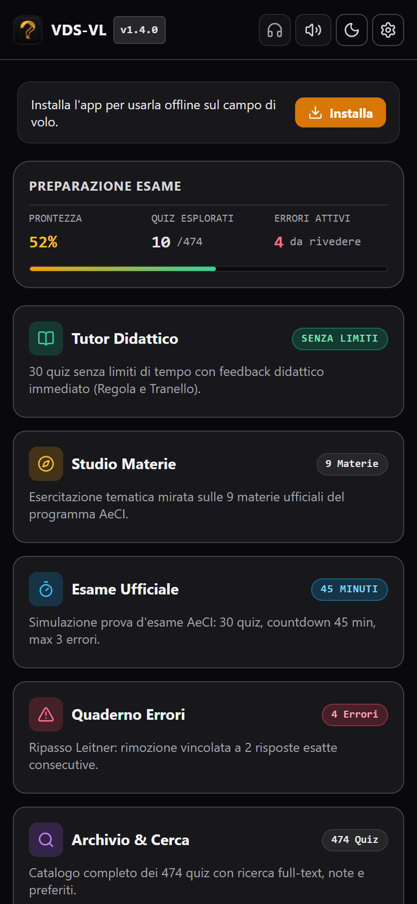

### 👉 Come si usa in 3 passi:
1. **Guarda la barra in alto**: controlli il Tema (Sole/Luna), passi alla Modalità Audio (Cuffie), regoli la Voce (Altoparlante) o apri le Impostazioni (Ingranaggio).
2. **Controlla il box "Preparazione Esame"**: ti mostra in tempo reale la tua percentuale di prontezza e quanti errori hai ancora attivi da sanare.
3. **Premi uno dei 6 bottoni giganti** per scegliere cosa fare:
   - 🟢 **TUTOR DIDATTICO**: ti alleni rilassato con spiegazione immediata.
   - 🟡 **STUDIO MATERIE**: ti alleni su un solo argomento (es. Aerodinamica o Meteo).
   - 🔵 **ESAME UFFICIALE**: prova reale con timer da 45 minuti e max 3 errori.
   - 🔴 **QUADERNO ERRORI**: ripassi solo le domande che hai sbagliato.
   - 🟣 **ARCHIVIO & CERCA**: cerchi qualsiasi domanda o numero di quiz.
   - 🟠 **STATISTICHE**: vedi i tuoi grafici di accuratezza per materia.

---

## 3. 🎯 Modalità TUTOR (Imparare Subito)

La modalità migliore per studiare e memorizzare senza stress.

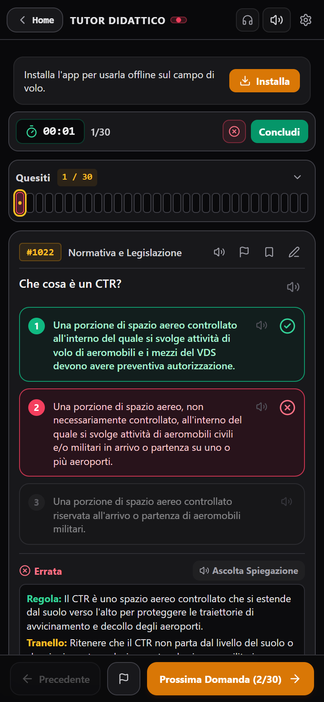

### 🎯 A cosa serve:
30 quiz estratti con le quote d'esame AeCI, **senza limiti di tempo** e con verifica istantanea ad ogni risposta.

### 👉 Come si usa in 3 passi:
1. Leggi la domanda e tocca l'opzione che ritieni corretta (**1**, **2** o **3**).
2. **Se indovini**: l'opzione diventa verde smeraldo e l'app avanza da sola alla domanda successiva dopo un istante.
3. **Se sbagli**: l'app si ferma subito! L'opzione scelta diventa **rossa**, la risposta giusta si illumina in **verde** e sotto compare il box didattico con:
   - **Regola**: il principio fisico o la norma ufficiale per cui quella risposta è corretta.
   - **Tranello**: la trappola lessicale in cui molti allievi cadono.

### 🚦 Semaforo Colori:
| Colore | Significato |
| :--- | :--- |
| 🟢 **Verde Smeraldo** | Risposta Esatta! |
| 🔴 **Rosso** | Risposta Errata (registrata nel Quaderno Errori per il ripasso). |
| 🟡 **Tacca con Punto Giallo** | Domanda attiva corrente sulla barra dei 30 quesiti. |
| 🟠 **Pulsante Arancione in basso** | Tocca per passare alla domanda successiva se hai sbagliato e hai finito di leggere la spiegazione. |

---

## 4. ⏱️ Modalità ESAME UFFICIALE (Simulazione AeCI)

La simulazione fedele della vera prova d'esame per il conseguimento dell'attestato VDS/VL.

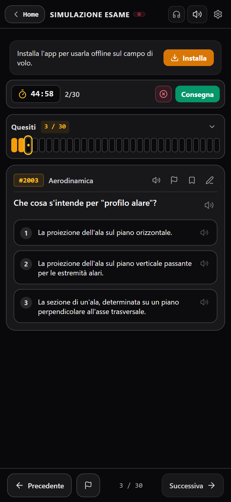

### 🎯 Regolamento Ufficiale AeCI:
- **30 quesiti** estratti esattamente secondo le quote ministeriali delle 9 materie.
- **Timer di 45 minuti** a scalare.
- **Nessun aiuto o suggerimento** durante la prova: esito e correzioni compaiono solo alla consegna!
- **Soglia Idoneità**: Massimo **3 errori** ammessi (minimo 27 risposte esatte). Con 4 errori si è bocciati (**NON IDONEO**).

### 👉 Come si usa in 3 passi:
1. Tocca la risposta (**1**, **2** o **3**) per ciascuna domanda.
2. Hai un dubbio? Tocca l'icona della bandierina `⚑` (o premi il tasto `F` su tastiera) per contrassegnarla e tornarci dopo.
3. Usa la barra a 30 tacche in alto per saltare in qualsiasi momento tra le domande. Quando hai finito, tocca **"Consegna"** in alto a destra.

---

## 5. 📊 Debriefing Esame & Ripasso a 1 Tocco

La schermata che si apre subito dopo aver consegnato l'esame.

  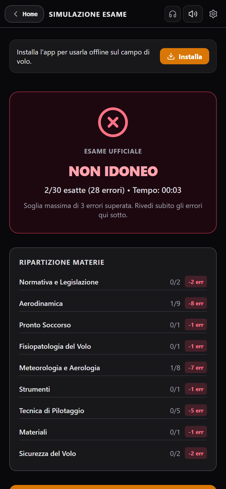
  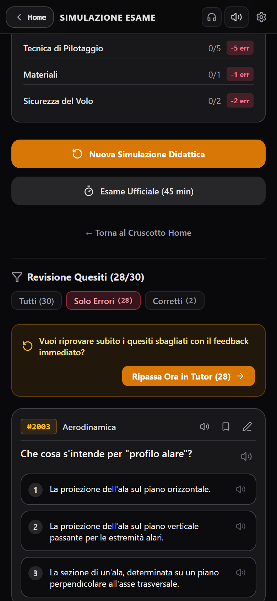

### 🎯 A cosa serve:
Sapere subito se hai passato l'esame (**IDONEO** o **NON IDONEO**) e ripassare immediatamente i quiz sbagliati prima che i dettagli svaniscano dalla memoria.

### 👉 Come si usa in 3 passi:
1. **Guarda l'esito**: vedi quante risposte esatte hai fatto (es. 28/30) e la tabella con gli errori divisi per materia.
2. **Usa i filtri rapidi**: tocca il filtro **"Solo Errori"** per nascondere i quiz indovinati e vedere solo quelli dove sei caduto.
3. **Premi "Ripassa Ora in Tutor"**: un pulsante arancione speciale che avvia all'istante una sessione di studio guidata sui soli quesiti che hai appena sbagliato, con tutte le spiegazioni di Regola e Tranello!

---

## 6. 📚 Studio per MATERIE

Allenamento intensivo mirato su un argomento specifico del programma teorico.

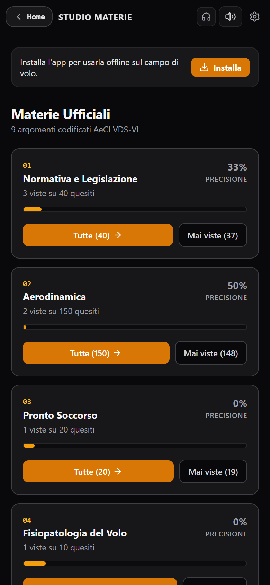

### 🎯 A cosa serve:
Colmare le tue lacune su una materia specifica (es. Aerodinamica o Meteorologia).

### 👉 Come si usa in 3 passi:
1. Scorri l'elenco delle 9 materie ufficiali.
2. Per ciascuna materia vedi subito quanti quiz hai già visto e la tua percentuale di precisione.
3. Tocca **"Tutte (X) ➔"** per esercitarti su tutta la materia, oppure **"Mai viste (X)"** per fare solo le domande che non hai ancora mai incontrato.

---

## 7. 🧠 QUADERNO ERRORI (Metodo Leitner)

L'arma segreta anti-bocciatura che trasforma i tuoi punti deboli in punti di forza.

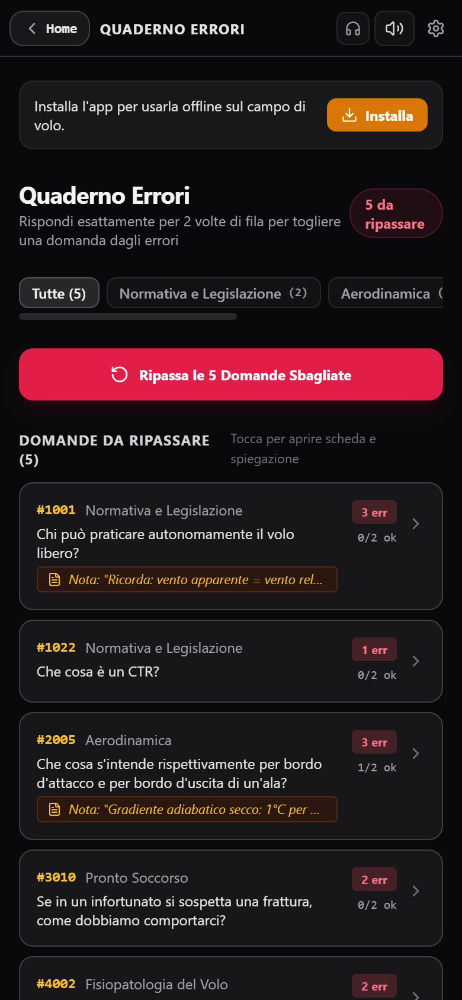

### 🎯 La Regola Ferrea:
Ogni domanda che sbagli in qualsiasi modalità entra **automaticamente** in questo quaderno.  
**Una domanda esce dal quaderno SOLO quando la indovini per 2 volte consecutive (`2/2 ok`)!**

### 👉 Come si usa in 3 passi:
1. **Filtra per materia**: tocca i bottoncini in alto (`01 Normativa`, `02 Aerodinamica`...) se vuoi ripassare solo gli errori di un argomento.
2. **Tocca una domanda qualsiasi**: si apre subito la sua scheda didattica completa con risposta esatta, Regola e Tranello.
3. **Premi "Ripassa le Domande Sbagliate"**: avvii un test a raffica sui soli quesiti del quaderno per portarli a 2/2 e cancellarli dall'elenco!

---

## 8. 🔍 Scheda Dettaglio Domanda (Regola & Tranello)

La schermata di ispezione approfondita accessibile toccando qualsiasi domanda nel Quaderno Errori, nell'Archivio o nelle Statistiche.

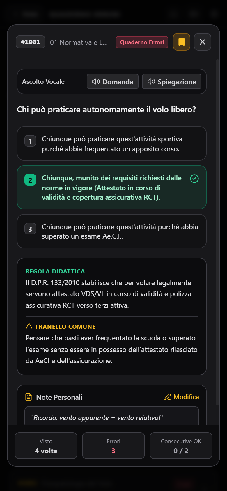

### 🎯 Elementi a schermo:
- **Testo Integrale**: la domanda ufficiale AeCI senza tagli.
- **Risposta Esatta in Verde con Spunta `✔`**: la soluzione corretta evidenziata all'istante.
- **Box REGOLA DIDATTICA**: il principio di volo spiegato in modo semplice.
- **Box TRANELLO COMUNE**: l'inganno mentale tipico da evitare.
- **Ascolto Vocale (Pulsanti in alto)**: tocca `Domanda` o `Spiegazione` per farti leggere il testo a voce dall'istruttore virtuale.
- **Note Personali**: tocca `Modifica` per scrivere un appunto privato che rimarrà salvato sulla domanda.
- **Telemetria in basso**: quante volte l'hai vista, quante volte l'hai sbagliata e se sei a 0/2 o 1/2 per toglierla dagli errori.

---

## 9. ⌨️ ARCHIVIO & CERCA (Senza Tastiera con Tastierino #ID)

Il catalogo completo di tutti i 474 quiz ministeriali, consultabile in 1 secondo senza mai aprire la tastiera virtuale dello smartphone.

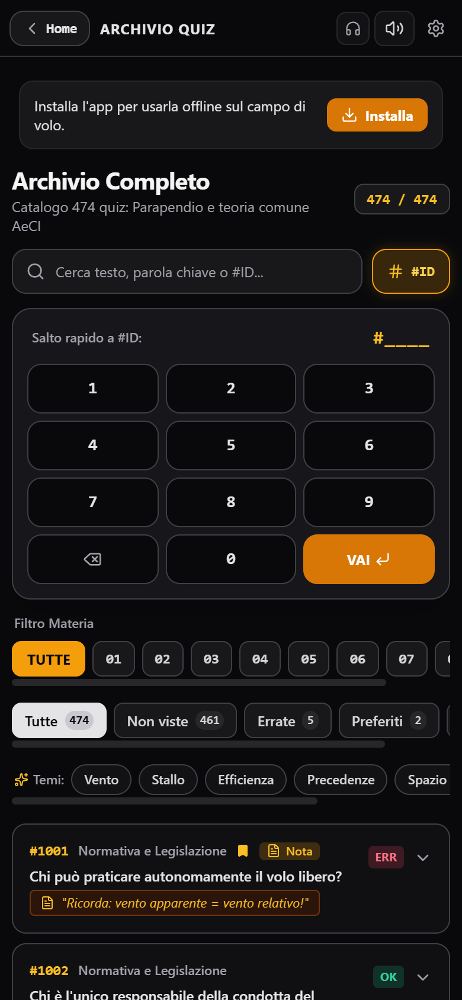

### 🎯 Come trovare qualsiasi quiz in 2 tocchi:
1. **Con le Chips Tematiche**: tocca bottoni come **Vento**, **Stallo**, **Efficienza**, **Precedenze**, **Spazio Aereo** o **Nubi** per vedere all'istante tutti i quiz che parlano di quell'argomento.
2. **Con il Tastierino `#ID`**:
   - Tocca il pulsante **`#ID`** accanto alla barra di ricerca.
   - Digita il numero della domanda ministeriale (es. `1`, `0`, `0`, `1`).
   - Tocca **`VAI ⏎`**: la pagina scorre da sola e apre la domanda desiderata!
3. **Con i Filtri di Stato**: tocca `Non viste`, `Errate` o `Preferiti` per scremare subito il catalogo.

---

## 10. 📈 STATISTICHE & ACCURATEZZA

La telemetria completa della tua preparazione all'esame.

  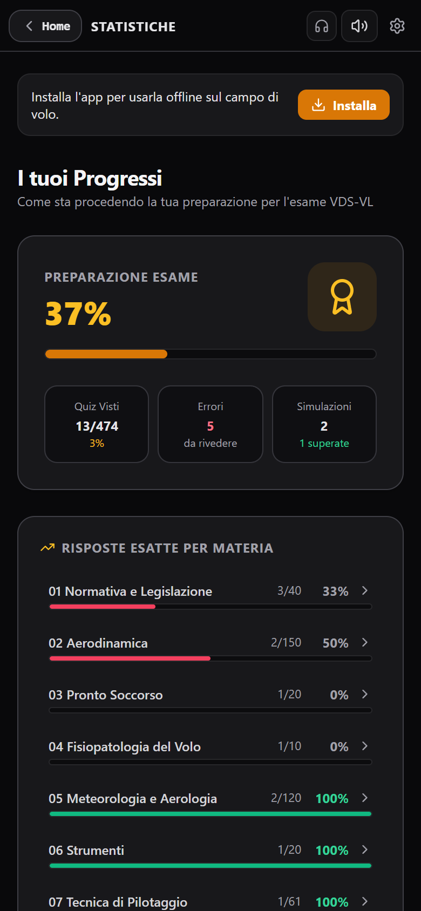
  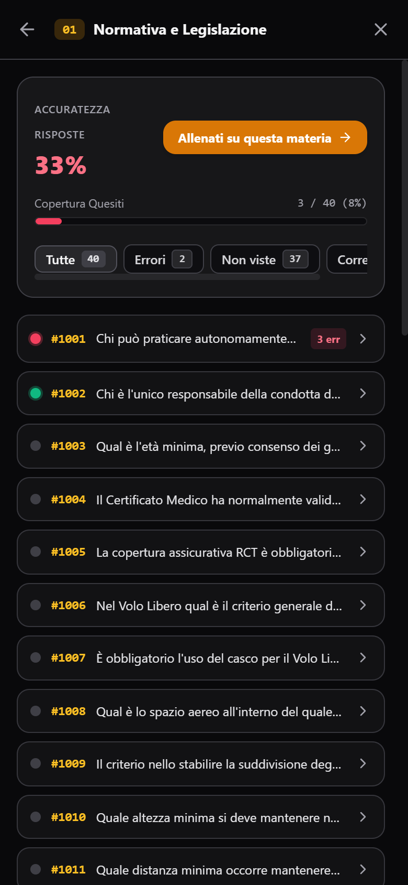

### 🎯 Come leggere i tuoi dati:
1. **Indice di Preparazione Esame (%)**: calcolato sulla tua precisione e su quanti quiz hai già visto. Quando supera l'**85-90%**, sei pronto per l'esame vero!
2. **Risposte Esatte per Materia**: vedi una barra per ciascuna delle 9 materie:
   - 🔴 **Rossa**: materia sotto il 70% (devi studiarla di più).
   - 🟢 **Verde**: materia sopra l'85% (sei solido).
3. **Tocca una materia per aprirla**: si apre il cruscotto dettagliato con l'elenco di tutte le singole domande e il tasto arancione **"Allenati su questa materia ➔"**.

---

## 11. 🎧 MODALITÀ AUDIO (Mani Libere per Bici, Corsa e Auto)

La modalità pensata per studiare mentre sei sui rulli in bici, corri all'aperto, guidi o sei a mani occupate.

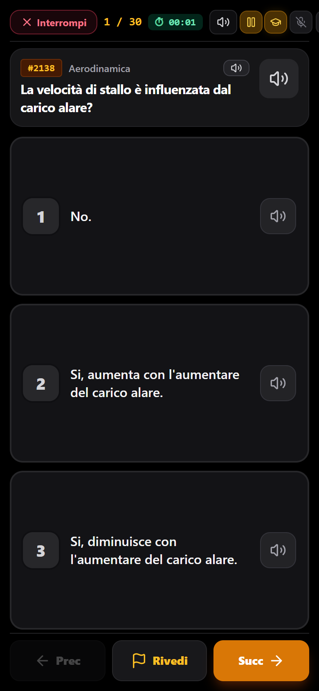

### 🎯 Caratteristiche Uniche:
- **3 Macro-Fasce Giganti**: occupano tutto lo schermo in verticale. Puoi toccare senza mirare con precisione con il pollice anche durante le vibrazioni.
- **Zero Scroll**: layout bloccato a tutto schermo (`100dvh`), non si scorre mai.
- **Riascolto Selettivo**:
  - Tocca il testo della domanda per risentire solo la domanda.
  - Tocca l'icona dell'altoparlante `[🔊]` a destra di una singola fascia per risentire **solo quella specifica opzione**, senza dover risentire tutto da capo!

### 🗣️ Comandi Vocali (Parla al telefono):
Puoi rispondere senza toccare nulla dicendo semplicemente:
- *"Uno"*, *"Due"*, *"Tre"* per scegliere la risposta.
- *"Avanti"*, *"Indietro"* per navigare.
- *"Ripeti"*, *"Ripeti Domanda"*, *"Rileggi la due"* per risentire.
- *"Spiega"* o *"Tutor"* per farti leggere la Regola e il Tranello.
- *"Pausa"* o *"Riprendi"* per fermare la voce.

### 🔊 Altoparlante vs 🎧 Cuffie (Zero Eco):
- **Modalità Altoparlante (Default)**: il microfono viene **automaticamente spento** mentre il telefono parla per evitare che la voce dello smartphone inneschi falsi comandi, e si riaccende solo a fine lettura.
- **Modalità Cuffie**: il microfono resta sempre acceso per permetterti di interrompere il parlato a voce in qualunque momento.

---

## 12. ⚙️ IMPOSTAZIONI, VOCE & GOOGLE DRIVE

Tutto configurabile da una schermata ordinata ad accordion a una sola sezione aperta alla volta.

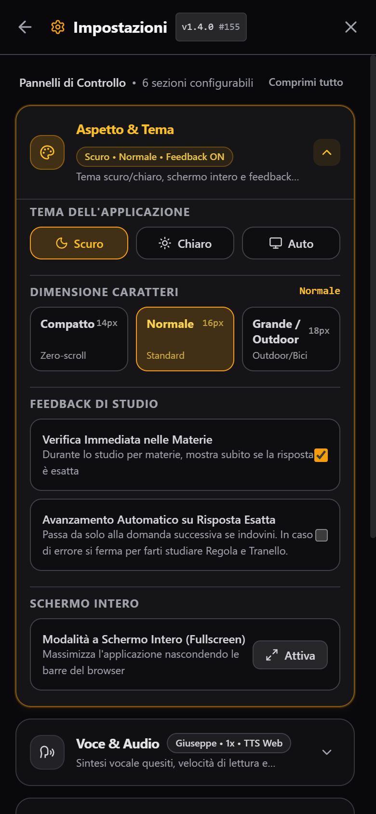

### 🎨 1. Aspetto & Dimensione Caratteri
- **Tema Scuro (Cockpit Zero-Blue)**: riposante per gli occhi e antiriflesso.
- **Tema Chiaro**: massimo contrasto sotto il sole in decollo.
- **Dimensione Testo a 3 Scatti**:
  - **Compatto (14px)**: per smartphone piccoli per non scorrere mai.
  - **Normale (16px)**: lettura bilanciata.
  - **Grande / Outdoor (18px)**: per leggere da lontano con telefono su manubrio o con guanti.

### 🎙️ 2. Voce Istruttore (Giuseppe ed Elsa)
- Scegli tra **Giuseppe** (timbro calmo da istruttore di volo) ed **Elsa** (brillante e cristallina).
- Scarica le voci nella memoria del telefono con 1 solo clic per ascoltare l'audio **100% offline senza connessione internet**.

### ☁️ 3. Backup Google Drive
- Collega il tuo account privato Google Drive per sincronizzare i tuoi progressi tra smartphone, tablet e PC.
- Nessun server intermedio: i dati viaggiano esclusivamente tra il tuo browser e il tuo Google Drive.

### 🔄 4. Come Aggiornare l'Applicazione
Tocca in qualunque momento il badge di versione (es. `v1.4.0`) in alto a destra o dentro le Impostazioni: si aprirà il pannello diagnostico con il pulsante **"Forza Aggiornamento PWA"** per ricaricare all'istante l'ultima versione disponibile.

---

## 13. ⌨️ Tabella Rapida Scorciatoie da Tastiera

Se usi l'applicazione da PC o con tastiera Bluetooth, puoi fare tutto senza mouse:

| Tasto | Azione Rapida |
| :---: | :--- |
| `1`, `2`, `3` | Seleziona l'opzione di risposta A, B o C |
| `F` | Aggiungi o rimuovi la bandierina di revisione (`⚑ Rivedi`) |
| `Spazio` o `➔` | Passa alla domanda successiva |
| `⬅` | Torna alla domanda precedente |
| `V` | Play / Pausa lettura vocale continua |
| `R` o `Shift + V` | Ricomincia da capo la lettura del quesito |
| `Q` | Ascolta solo la domanda (`Shift + Q` per ricominciare da capo) |
| `Alt + 1` / `2` / `3` | Ascolta solo la rispettiva opzione 1, 2 o 3 |
| `E` | Ascolta la spiegazione didattica (Regola e Tranello) |
| `Esc` | Ferma l'audio o chiudi modali aperte |

---

## 14. 🗣️ Tabella Rapida Comandi Vocali

In **Modalità Audio (Mani Libere)** puoi parlare direttamente al microfono in italiano:

| Cosa Dire | Cosa Fa l'App |
| :--- | :--- |
| **"Uno"** / **"Due"** / **"Tre"** | Risponde con l'opzione 1, 2 o 3 |
| **"Avanti"** / **"Prossima"** | Passa al quesito successivo |
| **"Indietro"** | Torna al quesito precedente |
| **"Ripeti"** | Rilegge domanda e tutte le opzioni da capo |
| **"Ripeti Domanda"** | Rilegge solo il testo della domanda |
| **"Ripeti Uno"** / **"Rileggi la due"** | Rilegge solo quell'opzione specifica |
| **"Spiega"** / **"Regola"** | Legge la spiegazione didattica (Regola e Tranello) |
| **"Bandiera"** | Mette la bandierina `⚑ Rivedi` sulla domanda |
| **"Pausa"** / **"Stop"** | Sospende la lettura vocale e il timer |
| **"Riprendi"** / **"Continua"** | Riavvia l'ascolto interrotto |
| **"Tutor"** | Attiva o disattiva il Tutor vocale automatico |
| **"Aiuto"** | Apre a schermo il foglio comandi |

---

  <strong>Buono studio e buoni voli! 🪂🦅</strong> 
  <em>VDS-VL Quiz Master • Conforme ai programmi ufficiali AeCI e D.P.R. 133/2010</em>

